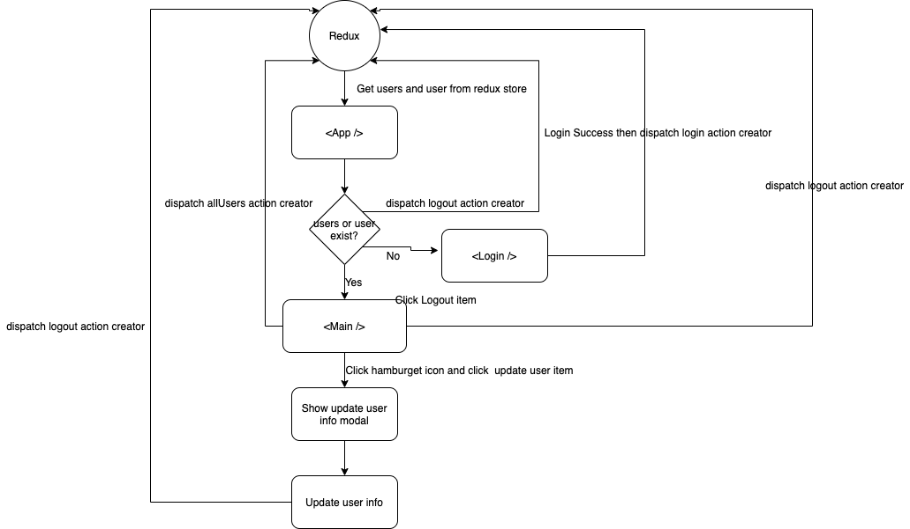

# React ICEYE Satelite


## Development
```bash
$ yarn
$ yarn start
# Listening at http://localhost:3000 with the default
```

## Production
```bash
$ yarn build
# All files were built in the `build` folder
```

## Run Tests
```bash
$ yarn test
# Run all tests in the `__tests__` folder
```

## Styleguidist
>Styleguidist will help you explore the usage of shared components
```bash
$ yarn run styleguide
# Listening at http://localhost:6060 with the default
```

## Flow Chart


## Data Flow Diagram


## Set up list

- [x] styling
  - [x] normalize.css
  - [x] styled-components (can easily inject props to modify CSS properties)
- [x] prettier (formatting codes)
- [x] redux (global state managemenet)
  - [x] redux-toolkit (easily writing redux codes without cumbersome boilerplate codes)
- [x] testing
  - [x] react-testing-library (can easily get component node to test)
  - [x] testing-library/jest-dom/extend-expect 
  - [x] jest-styled-components (to have more assertions of styled-components)